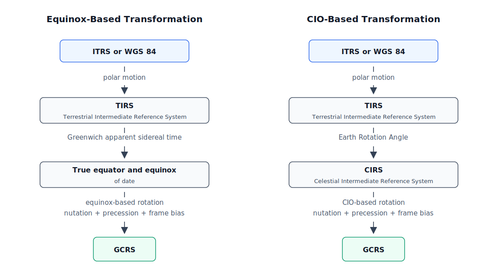

# Earth Rotation And Terrestrial Geometry

Earth rotation in DiffOrb evaluates ground-site positions defined in the International Terrestrial Reference System (`ITRS`) as position and velocity state vectors in the Geocentric Celestial Reference System (`GCRS`). DiffOrb follows the modern International Astronomical Union (`IAU`) Celestial Intermediate Origin (`CIO`)-based transformation and also provides the quantities needed for the traditional equinox-based transformation.[^iau][^kaplan]

## Two IAU Transformation Paths

The current `IAU` framework provides two equivalent ways to write the same `ITRS -> GCRS` transformation.[^iau][^kaplan]

*Transformation paths, after Kaplan, p. 56.[^kaplan]*

The equinox-based path is the traditional one:

1. `ITRS -> TIRS` by polar motion, where `TIRS` is the Terrestrial Intermediate Reference System.
2. `TIRS -> true equator and equinox of date` by Greenwich apparent sidereal time.
3. `true equator and equinox of date -> GCRS` by the equinox-based rotation for nutation, precession, and frame bias.[^kaplan][^urban]

The `CIO`-based path is the modern alternative:

1. `ITRS -> TIRS` by polar motion.
2. `TIRS -> CIRS` by the Earth Rotation Angle (`ERA`), where `CIRS` is the Celestial Intermediate Reference System.
3. `CIRS -> GCRS` by the `CIO`-based rotation for nutation, precession, and frame bias.[^kaplan][^urban]

In the `CIO`-based language, Earth rotation is represented by the angle between the `CIO` and the Terrestrial Intermediate Origin (`TIO`) measured along the equator of the Celestial Intermediate Pole (`CIP`).[^iau][^kaplan]

The two paths are mathematically equivalent. They do not represent different physics, and they must produce the same final vector for the same input vector. The difference is only how the same transformation is organized.[^kaplan]

In DiffOrb, both paths depend on the same kinds of inputs: Terrestrial Time (`TT`) for the precession-nutation and frame-bias model, Universal Time 1 (`UT1`) for the Earth's actual rotation angle, and Earth Orientation Parameters (`EOP`) for polar motion and modern observational corrections.[^kaplan][^iers]

## Why DiffOrb Uses The CIO-Based Path

DiffOrb uses the `CIO`-based path as its operational `ITRS -> GCRS` transformation.

Its main advantage is the one emphasized by Kaplan: in the `CIO`-based path, the three parts of the transformation are independent.[^kaplan][^sofa]

- Polar motion.
- Earth rotation itself.
- Nutation, precession, and frame bias.

That is not true in the equinox-based path, because Greenwich apparent sidereal time already contains precession and nutation. In the `CIO`-based path, the `ERA` is a direct measure of Earth rotation and is linear in `UT1`. This makes the structure of the transformation cleaner.[^iau][^kaplan]

DiffOrb does not discard the equinox-based path. The library also provides the quantities needed for equinox-based work. That matters for compatibility with classical references and for users who need to compare the two formulations. The concrete interfaces are described in the guides rather than in this Concepts page.

## Short-Term And Long-Term Models In DiffOrb

DiffOrb uses two models for the precession-nutation and frame-bias part of Earth rotation.

From `1799-01-01` through `2202-01-01`, DiffOrb uses the short-term `IAU 2006/2000A` model. In that interval, the `CIP`, the `CIO` locator, the precession-bias quantities, and the nutation terms follow the standard modern `IAU` formulation with the supplied `EOP` corrections.

Outside that interval, DiffOrb switches to the long-term model of Vondrak, Capitaine, and Wallace (2011). That switch is a library rule, not a silent extrapolation of the short-term series. The long-term model supplies the mean obliquity, the `CIP`, the `CIO` locator, and the long-term precession quantities used by the Earth-rotation layer.[^vondrak]

## Read Next

- Read [Time Scales And Epoch Storage](time-scales-and-epoch-storage.md) for the time-system rules behind `TT`, `UT1`, and `EOP`.
- Read [Earth Orientation Parameters](earth-orientation-parameters.md) for the measured Earth-rotation data used by
  polar motion and modern observational corrections.
- Read [Frames And State Representation](frames-and-state-representation.md) for the state-vector and reference-frame model used after terrestrial geometry has already been expressed in `GCRS`.
- Read [Observer Site Keys And Observer Types](observer-site-classes-and-observer-types.md) for how fixed and roving ground observer keys fit into the site model built on top of this transformation.
- Continue to [Get Earth Rotation Quantities And Matrices](../guides/get-earth-rotation-quantities-and-matrices.md) when you want the concrete matrix interfaces.
- Continue to [Configure Earth Orientation Data](../guides/configure-earth-orientation-data.md) when you need to check or
  update the local `EOP` file.
- Continue to [Convert Between UTC, TT, TDB, UT1](../guides/convert-between-utc-tt-tdb-ut1.md) when you want the time-side prerequisites behind `TT`, `UT1`, and `EOP`.
- Use the [Core API](../api/core.md), [Time API](../api/time.md), and [State API](../api/state.md) pages when you need
  details on EOP data, time views, and returned site states.

## References

[^iau]: International Astronomical Union. Resolutions adopted at the XXIVth and XXVIth General Assemblies, especially Resolution B1.8 of 2000 and the later precession supplements. <https://www.iau.org/Iau/Iau/Publications/List-of-Resolutions.aspx>
[^kaplan]: Kaplan, G. H. *The IAU Resolutions on Astronomical Reference Systems, Time Scales, and Earth Rotation And Terrestrial Geometrys: Explanation and Implementation*, especially Chapter 6 and the appendix text of the 2000 and 2006 resolutions.
[^urban]: Urban, S. E., & Seidelmann, P. K. (eds.). *Explanatory Supplement to the Astronomical Almanac*, especially the `ITRS -> GCRS` transformation sections.
[^iers]: International Earth Rotation and Reference Systems Service. *IERS Conventions (2010)*, especially the sections on Earth orientation, polar motion, and celestial intermediate quantities.
[^sofa]: Standards of Fundamental Astronomy. Earth-rotation and reference-system routines implementing the modern `CIO`/`CIP` formulation. <https://www.iausofa.org/>
[^vondrak]: Vondrak, J., Capitaine, N., & Wallace, P. T. (2011). *New precession expressions, valid for long time intervals*.
