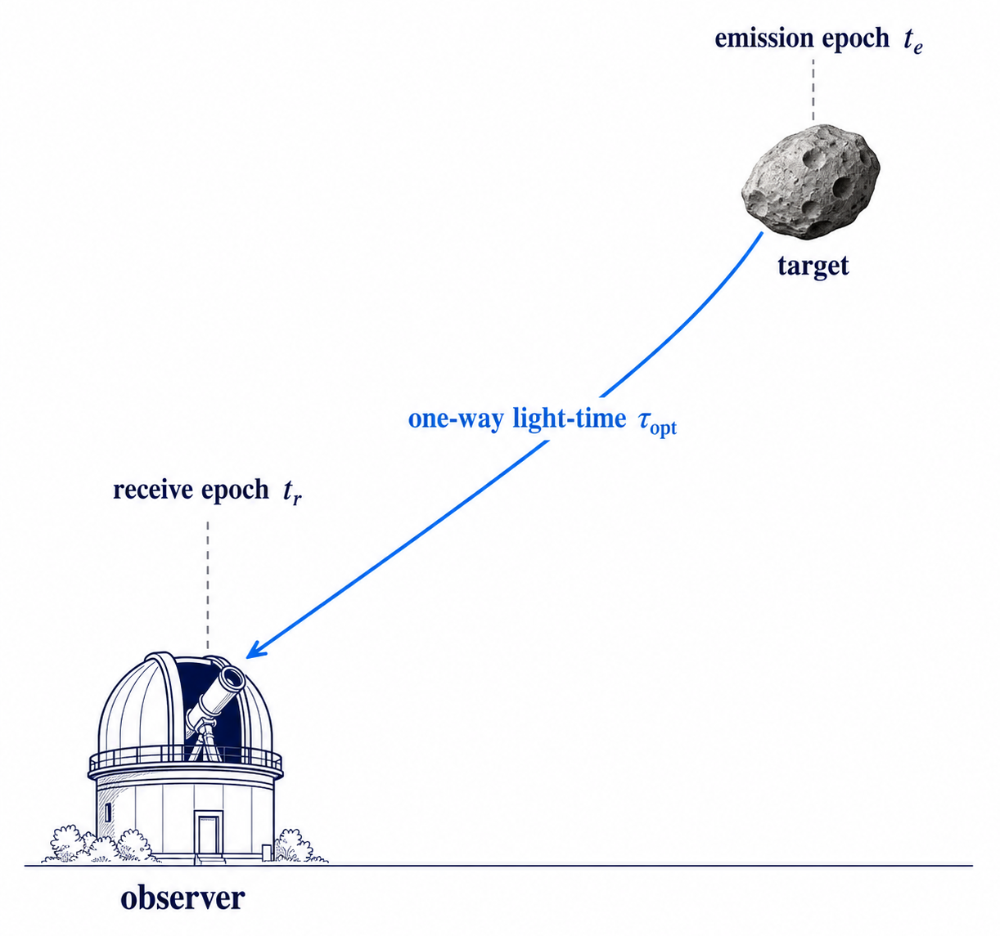
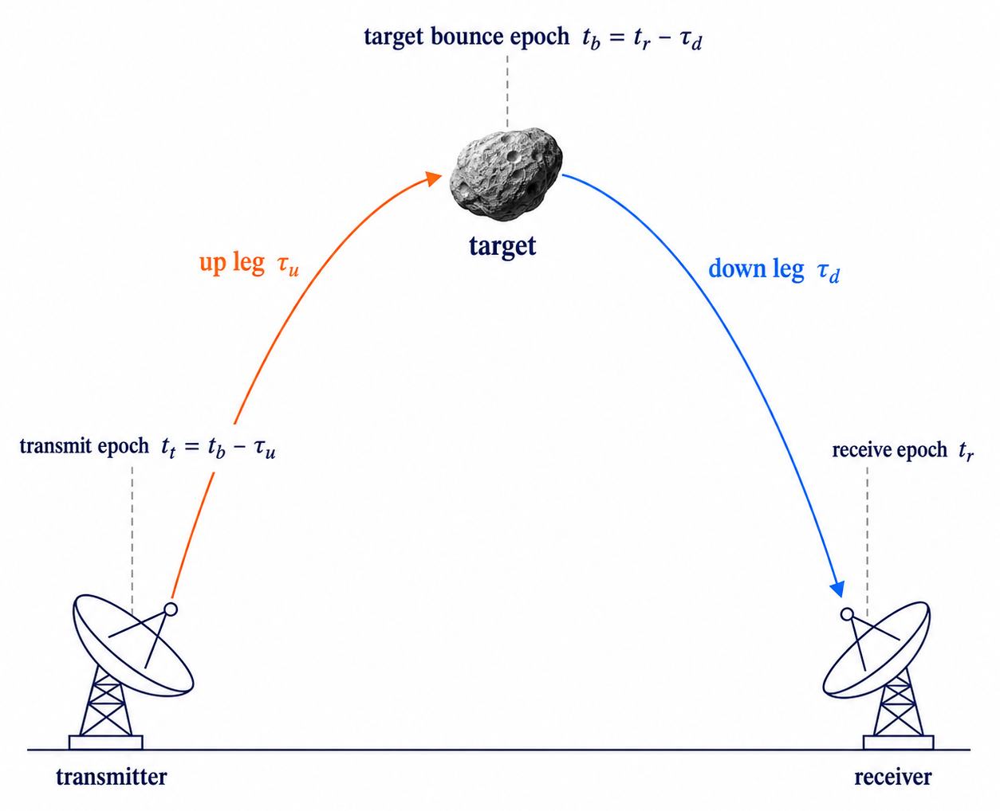

# Light-Time Model

Optical and radar observation models both need a light-time solution. The target state is not always evaluated at the
reported observation epoch. It is evaluated at the signal emission or bounce epoch required by the signal path.

## Optical One-Way Light Time

Optical observations use a one-way light-time solution. The observation epoch is the receive epoch \(t_{\mathrm{r}}\).
The observer is evaluated at \(t_{\mathrm{r}}\), and the target is evaluated at the earlier emission epoch
\(t_{\mathrm{r}} - \tau_{\mathrm{opt}}\). This gives the target direction seen by the observer.

{ width="560" style="display: block; margin: 1rem auto 0;" }

DiffOrb solves the one-way light time from:

\[
\tau_{\mathrm{opt}} =
{1 \over c}
\left\|
\boldsymbol{r}_{\mathrm{body}}(t_{\mathrm{r}} - \tau_{\mathrm{opt}})
-
\boldsymbol{r}_{\mathrm{obs}}(t_{\mathrm{r}})
\right\|
+ \Delta\tau_{\mathrm{rel}}
\]

Here \(c\) is the speed of light. \(\boldsymbol{r}_{\mathrm{body}}\) is the target position, and
\(\boldsymbol{r}_{\mathrm{obs}}\) is the observer position. The term \(\Delta\tau_{\mathrm{rel}}\) is the Shapiro
delay from gravitating bodies.[^shapiro]

The optical one-way solution uses the dense target trajectory, the observer state at the receive epoch, and the
time-scale rules that connect the observation time to `TDB`.

## Radar Two-Way Light Time

Radar observations use a two-way light-time solution. The signal path has a down leg from the target to the receiver and an up leg from the transmitter to the target.[^yeomans] DiffOrb can use either the receive epoch or the transmit epoch as the caller-supplied reference epoch.

When the reference epoch is the receive epoch \(t_{\mathrm{r}}\), DiffOrb solves the path backward from reception.

{ width="560" style="display: block; margin: 1rem auto 0;" }

DiffOrb first solves the down-leg delay:

\[
\tau_{\mathrm{d}} =
{1 \over c}
\left\|
\boldsymbol{r}_{\mathrm{body}}(t_{\mathrm{r}} - \tau_{\mathrm{d}})
-
\boldsymbol{r}_{\mathrm{rx}}(t_{\mathrm{r}})
\right\|
+ \Delta\tau_{\mathrm{d,rel}}
+ \Delta\tau_{\mathrm{d,cor}}
+ \Delta\tau_{\mathrm{d,tropo}}
\]

This defines the target bounce epoch:

\[
t_{\mathrm{b}} = t_{\mathrm{r}} - \tau_{\mathrm{d}}
\]

DiffOrb then solves the up-leg delay:

\[
\tau_{\mathrm{u}} =
{1 \over c}
\left\|
\boldsymbol{r}_{\mathrm{body}}(t_{\mathrm{b}})
-
\boldsymbol{r}_{\mathrm{tx}}(t_{\mathrm{b}} - \tau_{\mathrm{u}})
\right\|
+ \Delta\tau_{\mathrm{u,rel}}
+ \Delta\tau_{\mathrm{u,cor}}
+ \Delta\tau_{\mathrm{u,tropo}}
\]

The first subscript on each correction term identifies the signal-path leg: \(\mathrm{d}\) for the down leg and
\(\mathrm{u}\) for the up leg. The \(\Delta\tau_{\mathrm{d,rel}}\) and \(\Delta\tau_{\mathrm{u,rel}}\) terms are
relativistic Shapiro delays.[^shapiro] The \(\Delta\tau_{\mathrm{d,cor}}\) and
\(\Delta\tau_{\mathrm{u,cor}}\) terms are solar-corona delays.[^muhleman-anderson] The
\(\Delta\tau_{\mathrm{d,tropo}}\) and \(\Delta\tau_{\mathrm{u,tropo}}\) terms are delays caused by the Earth's
troposphere.[^urban]

When the reference epoch is the transmit epoch \(t_{\mathrm{tx}}\), DiffOrb solves the same two legs forward. It first finds the target bounce epoch from the transmitter-to-target up leg, then finds the receiver epoch from the target-to-receiver down leg.

The transmitter and receiver may be the same site for monostatic radar or different sites for bistatic radar. The radar delay is the solved round-trip light time.

## Radar Doppler Reduction

Radar Doppler reduction uses the same converged two-way light-time model as radar delay. Traditional formulations often
write Doppler from analytic expressions for the rates of change of the up-leg and down-leg path lengths.[^yeomans]

DiffOrb instead treats the Doppler shift as the derivative of the converged round-trip delay with respect to the selected radar reference epoch. This derivative is computed by automatic differentiation. This keeps radar delay and radar Doppler tied to the same signal-path model.

## Read Next

- Read [Numerical Integrators And Dense Trajectories](numerical-integrators-and-dense-trajectories.md) for the target
  trajectory queried by light-time iteration.
- Read [Observer Site Keys And Observer Types](observer-site-classes-and-observer-types.md) for ground, roving, and
  space observer states.
- Read [Ephemeris Products](ephemeris-products.md) for the product correction levels built on this model.
- Use [Get Radar Outputs In Monostatic And Bistatic Geometry](../guides/get-radar-outputs-in-monostatic-and-bistatic-geometry.md)
  for a concrete radar prediction path.

## References

[^shapiro]: Shapiro, I. I. (1964). *Fourth Test of General Relativity*. Physical Review Letters, 13(26), 789-791.
<https://doi.org/10.1103/PhysRevLett.13.789>
[^yeomans]: Yeomans, D. K., Campbell, D. B., Chodas, P. W., Giorgini, J. D., & Ostro, S. J. (1992). *Asteroid and
Comet Orbits Using Radar Data*. The Astronomical Journal, 103(1), 303-317.
[^muhleman-anderson]: Muhleman, D. O., & Anderson, J. D. (1981). *Solar wind electron densities from Viking
dual-frequency radio measurements*. The Astrophysical Journal, 247, 1093-1101. NASA NTRS record:
<https://ntrs.nasa.gov/citations/19810061604>
[^urban]: Urban, S. E., & Seidelmann, P. K. (eds.). *Explanatory Supplement to the Astronomical Almanac*, especially
Section 8.7.7 on tropospheric delay.
