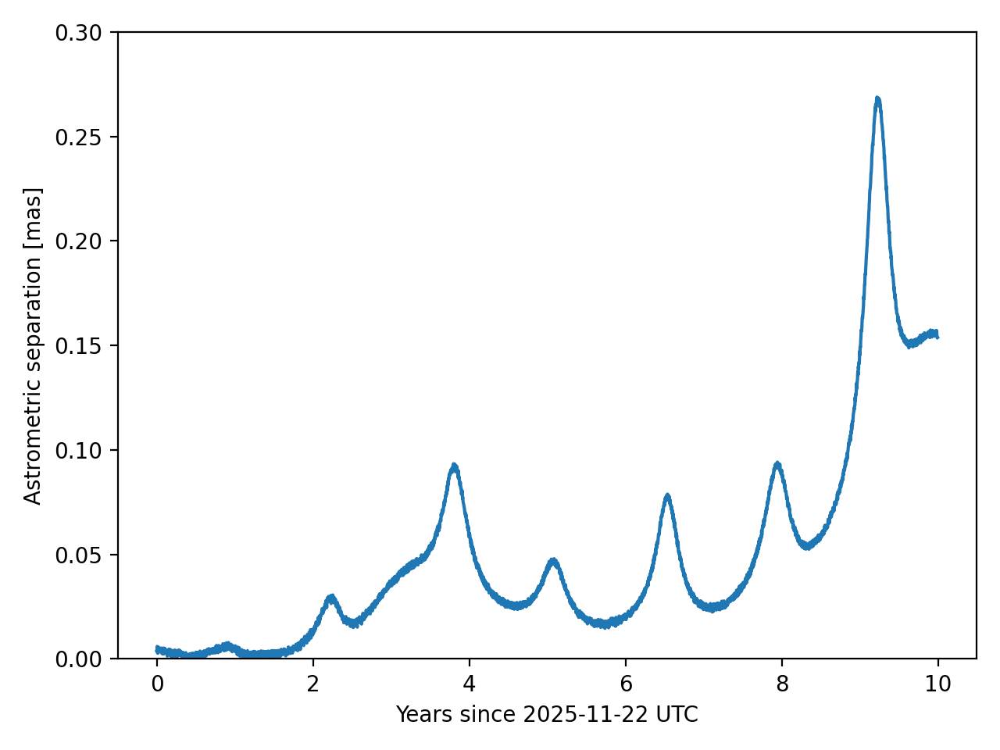
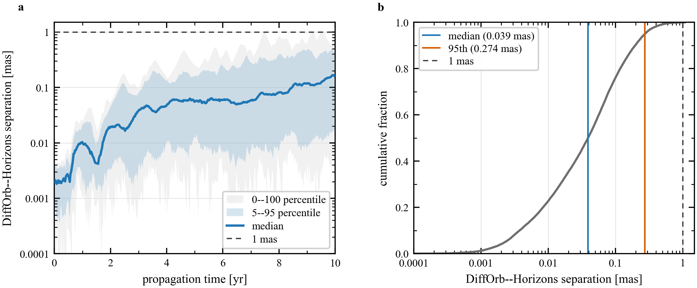

# Ephemeris Products Workflow

This workflow starts from one fixed orbit for `85472 Xizezong`. It propagates the orbit once. It then uses the same propagated trajectory to make optical, vector, radar, element, and event products.

The last section compares the optical output with JPL Horizons for one target and for a random set of numbered small bodies.

## Prerequisites

- Activate the project environment described in [Installation](../installation.md).
- Use a planetary SPK kernel such as `DE441`.
- Use a small-body SPK kernel such as `SB441-N16`.
- Make Earth orientation data available through `difforb.core.eop`.
- For the Horizons comparison, install `astroquery`, `astropy`, `numpy`, `matplotlib`, and `tqdm`.
- For the Horizons comparison, allow network access to JPL Horizons.

This workflow uses `DE441` for planets and the Moon. It uses `SB441-N16` for the 16 small-body perturbers used by `DynamicSystem.from_extended_system()`.

## Build And Propagate The Target

Use the fixed `BCRS` state below as the starting orbit. The state comes from JPL Horizons at `2461000.5 TDB`, which Horizons labels as `2025-Nov-21.0`.

The workflow propagates the body to `2035-11-26 UTC`. The extra day keeps the light-time solve inside the stored trajectory for the Horizons comparison.

```python
from difforb.core import BCRS, State, Time
from difforb.dynamics import DynamicSystem
from difforb.ephemeris import EphemerisGenerator
from difforb.integrator import NumericalIntegrator
from difforb.body import SmallBody
from difforb.spk import set_default_ephemeris

set_default_ephemeris([
    "/path/to/de441.bsp",
    "/path/to/sb441-n16.bsp",
])

t0 = Time.from_tdb_jd(2461000.0, 0.5)

orbit0 = State(
    tdb=t0.tdb(),
    pos=[
        1.685775738339898,
        -1.336388854313325,
        -0.2144927004440800,
    ],
    vel=[
        0.008995712853117517,
        0.006985684417802803,
        0.004020851173846060,
    ],
    frame=BCRS,
)

dynamic_system = DynamicSystem.from_extended_system()
force_model = dynamic_system.build_force_model()
integrator = NumericalIntegrator(method="IAS15", tol=1e-12)

body = SmallBody(orbit0)
body = body.propagate(
    t_start=t0.tdb(),
    t_end=Time.from_utc_date(2035, 11, 26).tdb(),
    force_model=force_model,
    integrator=integrator,
)

generator = EphemerisGenerator(body)
print(body.trajectory is not None)
```

```text title="Output"
True
```

From this point on, all products use the same propagated `body`.

## Make An Optical Table

Use Xinglong Station (`327`) as the observer. Sample the target every ten days in `UTC`.

```python
import jax.numpy as jnp

from difforb.body import Site
from difforb.core import Time

observer = Site.from_code("327").require_ground()
t_obs_start = Time.from_utc_date(2025, 11, 22)
t_obs = t_obs_start + jnp.arange(0.0, 3650.0, 10.0)

optical = generator.optical_table(t_obs, observer)

print(float(optical.astrometric_ra[0]))
print(float(optical.astrometric_dec[0]))
print(float(optical.delta[0]))
print(float(optical.elongation[0]))
```

```text title="Output"
299.63079154708237
-12.728699350320287
2.4837233057400416
59.85538434604309
```

These values are `astrometric_ra`, `astrometric_dec`, `delta`, and `elongation`. Angles are in degrees. `delta` is in `au`.

## Make A Vector Table

Use a vector table when you need relative states instead of sky angles.

```python
import numpy as np

vector_table = generator.vector_table(t_obs, observer)

print(float(vector_table.light_time[0]))
print(np.asarray(vector_table.astrometric.pos[0], dtype=float))
print(np.asarray(vector_table.apparent.vel[0], dtype=float))
```

```text title="Output"
0.014344789725735281
[ 1.19779699 -2.10586811 -0.54725073]
[ 0.0240664  -0.00070639  0.00058723]
```

These values are `light_time`, `astrometric.pos`, and `apparent.vel`. Light time is in days. Position is in `au`. Velocity is in `au / day`.

## Make A Radar Prediction

Use DSS-14 (`253`) as both transmitter and receiver. Use `8560 MHz` as the transmit frequency.

For this main-belt target, treat the result as a theoretical radar prediction.

```python
radar_site = Site.from_code("253").require_ground()
t_radar = Time.from_utc_date(2025, 12, 1)

radar = generator.radar_table(
    t_radar,
    rx=radar_site,
    tx=radar_site,
    tx_freq=8.56e9,
)

print(float(radar.radar_delay))
print(float(radar.radar_range))
print(float(radar.radar_doppler))
print(float(radar.radar_rate))
```

```text title="Output"
2586838645.3943214
5.183995683383441
-1173883.335861241
0.02374434567641431
```

These values are `radar_delay`, `radar_range`, `radar_doppler`, and `radar_rate`. The units are microseconds, `au`, `Hz`, and `au / day`.

## Make An Element Table

Convert the propagated state to heliocentric ecliptic osculating elements.

```python
t_elem = Time.from_tdb_date(2026, 7, 1)
elements = generator.elements_table(t_elem.tdb())

print(float(elements.a))
print(float(elements.e))
print(float(elements.inc))
```

```text title="Output"
2.3099264144840133
0.20294990321914474
0.16238174175527775
```

These values are `a`, `e`, and `inc`. The semi-major axis is in `au`. The inclination is in radians.

## Search For Events

Use the same trajectory to search for heliocentric apsides and close approaches to Earth.

```python
from difforb.body import EphemerisBody
import numpy as np

sun = EphemerisBody("sun")
earth = EphemerisBody("earth")
t_end = Time.from_utc_date(2035, 11, 25)

apsides = generator.find_apsides(t0.tdb(), t_end.tdb(), sun, max_events=3)
close = generator.find_close_approaches(
    t0.tdb(),
    t_end.tdb(),
    earth,
    max_distance=2.5,
    max_events=3,
)

print(np.asarray(apsides.valid.t_apsides.jd, dtype=float))
print(np.asarray(apsides.valid.distance, dtype=float))
print(np.asarray(close.valid.t_close.jd, dtype=float))
print(np.asarray(close.valid.distance, dtype=float))
print(np.asarray(close.valid.relative_velocity, dtype=float))
```

```text title="Output"
[2461426.15370567 2462066.9021046  2462708.63990151]
[2.77863543 1.84195244 2.77879022]
[2461350.61712342 2461826.37614569 2462388.18797333]
[1.76941689 1.26527174 1.42852572]
[0.00828067 0.00579234 0.00638136]
```

The first two arrays are apside epochs and distances. The next three arrays are close-approach epochs, distances, and relative velocities. Epochs are `TDB` Julian dates. Distances are in `au`. Relative velocities are in `au / day`.

## Compare With JPL Horizons

### Compare One Target

Use the same target, observer, and daily `UTC` grid in Horizons. Compare DiffOrb astrometric `RA` and `DEC` with Horizons `RA` and `DEC`.

```python
import astropy.units as u
import numpy as np
from astropy.coordinates import SkyCoord
from astroquery.jplhorizons import Horizons

t_horizons = t_obs_start + jnp.arange(0.0, 3650.0, 1.0)
optical_daily = generator.optical_table(t_horizons, observer)
epochs_utc_jd = np.asarray(t_horizons.utc.jd, dtype=float)

horizons = Horizons(
    id="85472",
    location="327",
    epochs={"start": "2025-11-22", "stop": "2035-11-19", "step": "1d"},
)
eph = horizons.ephemerides(
    refsystem="ICRF",
    refraction=False,
    extra_precision=True,
    cache=False,
)

difforb_astrometric = SkyCoord(
    ra=np.asarray(optical_daily.astrometric_ra, dtype=float) * u.deg,
    dec=np.asarray(optical_daily.astrometric_dec, dtype=float) * u.deg,
    frame="icrs",
)
horizons_astrometric = SkyCoord(
    ra=np.asarray(eph["RA"], dtype=float) * u.deg,
    dec=np.asarray(eph["DEC"], dtype=float) * u.deg,
    frame="icrs",
)

separation = difforb_astrometric.separation(horizons_astrometric).to(u.mas)
values = separation.value

print("COUNT", len(values))
print(
    "MIN_MAX_MEDIAN_P95",
    float(values.min()),
    float(values.max()),
    float(np.median(values)),
    float(np.percentile(values, 95)),
)
print("FIRST3", values[:3])
print("HORIZONS0", float(eph["RA"][0]), float(eph["DEC"][0]))
```

```text title="Output"
COUNT 3650
MIN_MAX_MEDIAN_P95 0.0002265390586468172 0.2688633196678126 0.03117657213906492 0.15746311558315265
FIRST3 [0.00397177 0.00392566 0.00597746]
HORIZONS0 299.630791546 -12.72869935
```

The separation is in milliarcseconds. In this run, it stays below `0.3 mas` over `3650` daily epochs.

```python
import matplotlib.pyplot as plt

years = (epochs_utc_jd - epochs_utc_jd[0]) / 365.25

fig, ax = plt.subplots()
ax.plot(years, separation.value)
ax.set(
    xlabel="Years since 2025-11-22 UTC",
    ylabel="Astrometric separation [mas]",
)
ax.set_ylim(0.0, 0.3)
```



### Compare 100 Numbered Small Bodies

This check draws `100` numbered small bodies with a fixed seed, queries one Horizons `BCRS` Cartesian state for each
body at the same initial epoch, propagates the whole batch in DiffOrb, and compares the astrometric optical output with
Horizons.

Use one fixed `TDB` initial epoch for all target states. Use one fixed `UTC` grid for the observer ephemerides. The
observer is Xinglong Station (`327`). The target sample below uses the numbered-asteroid range stored with this
validation run. If the numbered-asteroid range is refreshed from JPL SBDB, the selected target IDs can change.

```python
from pathlib import Path

import astropy.units as u
import matplotlib.pyplot as plt
import jax.numpy as jnp
import numpy as np
from astropy.coordinates import SkyCoord
from astroquery.jplhorizons import Horizons
from tqdm import tqdm

from difforb.body import Site, SmallBody
from difforb.core import BCRS, State, Time

target_count = 100
random_seed = 43
number_min = 1
number_max = 895_910
excluded_target_ids = {
    1, 2, 3, 4, 7, 10, 15, 16, 31, 52, 65, 87, 88, 107, 511, 704
}

initial_epoch = Time.from_tdb_date(2026, 1, 1)
initial_epoch_jd = float(np.asarray(initial_epoch.tdb().jd))

time_offsets = np.arange(0.0, 365.0 * 10.0, 10.0)
compare_times = Time.from_utc_date(2026, 1, 1) + jnp.asarray(time_offsets)
horizons_range = {
    "start": "2026-01-01",
    "stop": "2035-12-22",
    "step": "10d",
}

rng = np.random.default_rng(random_seed)
selected = set()
while len(selected) < target_count:
    target_id = int(rng.integers(number_min, number_max + 1))
    if target_id in excluded_target_ids:
        continue
    selected.add(target_id)

target_ids = np.array(sorted(selected), dtype=int)
observer_code = "327"
observer = Site.from_code(observer_code).require_ground()
```

Fetch one Horizons `BCRS` Cartesian state at the same `TDB` epoch for each target.

```python
def fetch_bcrs_state(target_id):
    table = Horizons(
        id=str(target_id),
        id_type="smallbody",
        location="@0",
        epochs=initial_epoch_jd,
    ).vectors(
        refplane="frame",
        aberrations="geometric",
        cache=True,
    )
    row = table[0]
    return {
        "target_id": int(target_id),
        "x": float(row["x"]),
        "y": float(row["y"]),
        "z": float(row["z"]),
        "vx": float(row["vx"]),
        "vy": float(row["vy"]),
        "vz": float(row["vz"]),
    }


state_rows = []
for target_id in tqdm(target_ids):
    state_rows.append(fetch_bcrs_state(target_id))

initial_epoch_floor = np.floor(initial_epoch_jd)
state_epoch = Time.from_tdb_jd(
    np.full(len(state_rows), initial_epoch_floor),
    np.full(len(state_rows), initial_epoch_jd - initial_epoch_floor),
)

initial_state = State(
    tdb=state_epoch.tdb(),
    pos=np.column_stack(
        [
            [row["x"] for row in state_rows],
            [row["y"] for row in state_rows],
            [row["z"] for row in state_rows],
        ]
    ),
    vel=np.column_stack(
        [
            [row["vx"] for row in state_rows],
            [row["vy"] for row in state_rows],
            [row["vz"] for row in state_rows],
        ]
    ),
    frame=BCRS,
)
```

Create one batched `SmallBody`, propagate it for the full comparison interval, and build one batched optical table. Start the stored trajectory before the first observer epoch so the light-time solve stays inside the propagated interval. The `grid=True` call returns one time series for each target.

```python
target_batch = SmallBody.create(initial_state)
target_batch = target_batch.propagate(
    t_start=Time.from_utc_date(2025, 12, 20).tdb(),
    t_end=Time.from_utc_date(2036, 1, 3).tdb(),
    force_model=force_model,
    integrator=integrator,
)

batch_generator = EphemerisGenerator(target_batch)
difforb_optical = batch_generator.optical_table(
    compare_times,
    observer,
    grid=True,
)

difforb_coord = SkyCoord(
    ra=np.asarray(difforb_optical.astrometric_ra, dtype=float) * u.deg,
    dec=np.asarray(difforb_optical.astrometric_dec, dtype=float) * u.deg,
    frame="icrs",
)
```

Query Horizons for the same objects, observer, and `UTC` grid. `id_type="smallbody"` keeps numbered small bodies
separate from major-body IDs.

```python
horizons_ra = np.empty((len(target_ids), len(time_offsets)))
horizons_dec = np.empty_like(horizons_ra)

for row_index, target_id in enumerate(tqdm(target_ids)):
    eph = Horizons(
        id=str(target_id),
        id_type="smallbody",
        location=observer_code,
        epochs=horizons_range,
    ).ephemerides(
        refsystem="ICRF",
        refraction=False,
        extra_precision=True,
        quantities="1",
        cache=True,
    )
    if len(eph) != len(time_offsets):
        raise RuntimeError(f"{target_id} returned {len(eph)} epochs")

    horizons_ra[row_index] = np.asarray(eph["RA"], dtype=float)
    horizons_dec[row_index] = np.asarray(eph["DEC"], dtype=float)

horizons_coord = SkyCoord(
    ra=horizons_ra * u.deg,
    dec=horizons_dec * u.deg,
    frame="icrs",
)

separation = difforb_coord.separation(horizons_coord).to_value(u.mas)

print("TARGETS", len(target_ids))
print("EPOCHS", len(time_offsets))
print("MEDIAN_MAS", float(np.median(separation)))
print("P95_MAS", float(np.percentile(separation, 95)))
print("P99_MAS", float(np.percentile(separation, 99)))
print("MAX_MAS", float(np.max(separation)))
```

```text title="Output"
TARGETS 100
EPOCHS 365
MEDIAN_MAS 0.03903224717521309
P95_MAS 0.2738868930459874
P99_MAS 0.48034178172244024
MAX_MAS 1.0784751105453636
```

Plot the epoch-wise percentile envelope and the cumulative distribution of all separations. The full run makes
`100 x 365` comparisons.

```python
years = np.asarray(time_offsets, dtype=float) / 365.25
p00, p05, p50, p95, p100 = np.percentile(separation, [0, 5, 50, 95, 100], axis=0)
flat = np.sort(separation.ravel())
cdf = np.arange(1, flat.size + 1, dtype=float) / flat.size

fig, (ax_time, ax_cdf) = plt.subplots(1, 2, figsize=(6.85, 2.85))

ax_time.fill_between(years, p00, p100, color="0.55", alpha=0.12, linewidth=0, label="0-100 percentile")
ax_time.fill_between(years, p05, p95, color="#1f77b4", alpha=0.18, linewidth=0, label="5-95 percentile")
ax_time.plot(years, p50, color="#1f77b4", linewidth=1.6, label="median")
ax_time.axhline(1.0, color="0.25", linestyle=(0, (4, 3)), linewidth=0.9, label="1 mas")
ax_time.set_yscale("log")
ax_time.set_xlabel("propagation time [yr]")
ax_time.set_ylabel("DiffOrb-Horizons separation [mas]")
ax_time.legend()

ax_cdf.plot(flat, cdf, color="0.4", linewidth=1.5)
ax_cdf.axvline(np.median(separation), color="#1f77b4", linewidth=1.1, label="median")
ax_cdf.axvline(np.percentile(separation, 95), color="#d95f02", linewidth=1.1, label="95th")
ax_cdf.axvline(1.0, color="0.25", linestyle=(0, (4, 3)), linewidth=0.9, label="1 mas")
ax_cdf.set_xscale("log")
ax_cdf.set_xlabel("DiffOrb-Horizons separation [mas]")
ax_cdf.set_ylabel("cumulative fraction")
ax_cdf.legend()

fig.tight_layout()

fig_path = Path("numbered-small-bodies-vs-horizons.png")
fig.savefig(fig_path, dpi=400)
print(fig_path)
```



This batch comparison is a broad external check. It is not a fixed acceptance test. The result can change when Horizons
updates an orbit solution, when the random sample changes, or when a different force model, observer, kernel set, or
numbered-asteroid range is used.

## Result

This workflow produces these products from one propagated `SmallBody`:

- an optical table
- a vector table
- a radar prediction
- an element table
- apside and close-approach event tables
- a Horizons comparison for optical astrometry
- a 100-target Horizons comparison plot for numbered small bodies

The numeric output above used `DE441`, `SB441-N16`, Xinglong Station (`327`), and a fixed random sample of numbered
small bodies. Small numerical differences can appear across platforms, JAX or XLA versions, dependency versions, and
Horizons service revisions.
