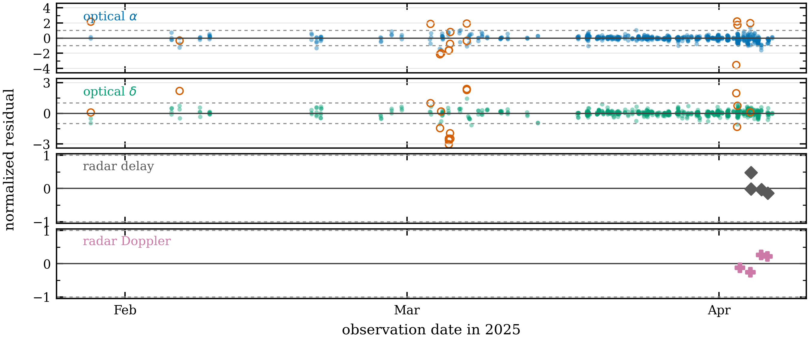
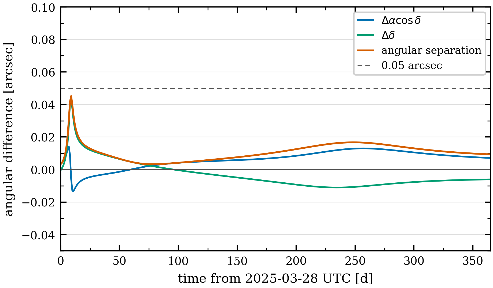

# Orbit Determination Workflow

This workflow reproduces the 2025 BC10 orbit-determination validation case included with DiffOrb. It fits a mixed
optical and radar observation set, checks station-level residual statistics, changes one station from the default optical
weights to reported ADES uncertainties, and compares the final orbit with the JPL Horizons JPL#51 solution.

The final product is a fitted `BCRS` Cartesian state at `JD 2460762.5 TDB`, its covariance, residual diagnostics, and a
one-year optical prediction check.

## Prerequisites

- Activate the project environment described in [Installation](../installation.md).
- Use a planetary kernel such as `de441.bsp`.
- Use the `SB441-N16` asteroid-perturber kernel.
- Use online access to fetch fresh MPC and JPL observations, or use a local ADES PSV cache.
- Install `astroquery` and use online access when you run the Horizons comparison code.
- Treat the printed values below as reference output for the bundled validation data. Online observation data can change.

For the model behind the solve, read [Orbit Determination Overview](../concepts/orbit-determination-overview.md),
[Initial Orbit Determination](../concepts/initial-orbit-determination.md), [Differential Correction](../concepts/differential-correction.md),
[Weighting And Debiasing Models](../concepts/weighting-and-debiasing-models.md), and [Outlier Rejection](../concepts/outlier-rejection.md).

## Load Data

2025 BC10 was discovered by Pan-STARRS 1 on `2025-01-28`. It made a close Earth approach in early April 2025, when
Goldstone radar delay and Doppler observations were obtained. The validation case uses `799` optical observations from
the IAU MPC and `8` radar observations from the JPL Small-Body Radar Astrometry database.

Load the ephemeris first. Then load the observation set. Use `load_online_observations(...)` when you want to refresh
the data. Use `load_local_observations(...)` when you want a fixed cached PSV file.

```python
from pathlib import Path

from difforb.astrometry import load_local_observations, load_online_observations
from difforb.spk import Ephemeris, set_default_ephemeris

planetary_kernel = Path("/path/to/de441.bsp")
asteroid_kernel = Path("/path/to/sb441-n16.bsp")
observation_cache = Path("cache/2025_BC10-online.psv")

ephemeris = Ephemeris([str(planetary_kernel), str(asteroid_kernel)])
set_default_ephemeris(ephemeris)

if observation_cache.exists():
    obs = load_local_observations(str(observation_cache))
else:
    obs = load_online_observations("2025 BC10", save_path=str(observation_cache))

print("NAME", obs.name)
print("N_OBS", len(obs))
print("N_OPTICAL", obs.num_optical)
print("N_RADAR", obs.num_radar)
print("T_START", obs.t_start.ut.iso_string)
print("T_END", obs.t_end.ut.iso_string)
```

```text title="Reference output"
NAME 2025 BC10
N_OBS 807
N_OPTICAL 799
N_RADAR 8
T_START 2025-01-28 13:31:33.500
T_END 2025-04-06 06:39:50.960
```

## Build The Model

Use the extended dynamical system. It uses the planetary background and the supported asteroid perturbers. Use `IAS15`
for the integration.

```python
from difforb.body import EphemerisBody
from difforb.dynamics import DynamicSystem
from difforb.integrator import NumericalIntegrator
from difforb.od import DCBucketPolicy, DCSolver, IODSolver, ODSolver

force_model = DynamicSystem.from_extended_system(ephemeris).build_force_model()
integrator = NumericalIntegrator(
    method="IAS15",
    tol=1e-12,
    max_steps=4096,
    initial_step=1e-6,
)

solver = ODSolver(
    IODSolver(),
    DCSolver(
        lsq_tol=1e-11,
        lsq_max_iters=20,
        sun=EphemerisBody("sun", eph=ephemeris),
        earth=EphemerisBody("earth", eph=ephemeris),
        bucket_policy=DCBucketPolicy(),
    ),
)
```

This sets the force and integration path used for the 2025 BC10 validation case. The target small body is integrated.
The Sun, planets, Moon, Pluto, and asteroid perturbers are read from SPK ephemerides.

## Configure The Solve

The initial orbit uses a `1` day optical arc. Differential correction then uses the full observation arc in one stage.
The optical baseline is the `VFCC17` weighting model with `EgglDebiasPolicy`. Radar rows use their reported
uncertainties. The chi-square outlier rejection thresholds are tighter than the defaults.

```python
from difforb.astrometry import ADESWeightPolicy, EgglDebiasPolicy, InteractiveWeightPolicy, VFCC17WeightPolicy
from difforb.od import Chi2OutlierRejecter, DCStrategy, IODStrategy, InteractiveOutlierPolicy

iod_strategy = IODStrategy(
    arc_days=1.0,
    max_candidates=10,
    init_rho=(1.0, 1.0),
)

dc_strategy = DCStrategy(
    incremental_arc_days=[1.0e9],
    min_observations=3,
    epoch_strategy="keep_initial",
)

vfcc = VFCC17WeightPolicy()
ades = ADESWeightPolicy()
debias_policy = EgglDebiasPolicy()


def make_outlier_policy():
    return InteractiveOutlierPolicy(
        Chi2OutlierRejecter(
            chi2_rej_2d=3.5,
            chi2_rec_2d=2.5,
        ),
        enable_auto_rejecter=True,
        max_iters=10,
    )
```

The `make_outlier_policy()` helper returns a fresh policy for each solve. This keeps the first and second solves
independent.

## Run The Baseline Solve

Run the first solve with `VFCC17WeightPolicy` for optical observations. Then inspect station-level normalized residual
spread.

```python
from difforb.od import ODAnalysis

first_weight_policy = InteractiveWeightPolicy(
    default_policy=vfcc,
    additional_policies=[ades],
)

first_result = solver.solve(
    obs,
    force_model=force_model,
    integrator=integrator,
    weight_policy=first_weight_policy,
    debias_policy=debias_policy,
    outlier_policy=make_outlier_policy(),
    iod_strategy=iod_strategy,
    dc_strategy=dc_strategy,
    log_detail="quiet",
)

first_dc = first_result.dc_result
first_analysis = ODAnalysis.from_result(obs, first_dc)
first_stats = first_analysis.station_summary()

cols = [
    "station_key",
    "obs",
    "inliers",
    "normalized_residual_spread",
    "std_normalized_ra_residual",
    "std_normalized_dec_residual",
]

w74_first = first_stats[first_stats["station_key"] == "W74"]

print("FIRST_NORMALIZED_RESIDUAL_RMS", f"{first_dc.normalized_residual_rms:.6f}")
print("FIRST_OPTICAL_INLIERS", first_dc.optical.n_inliers, first_dc.optical.n_obs)
print("FIRST_RADAR_INLIERS", first_dc.radar.n_inliers, first_dc.radar.n_obs)
print(w74_first[cols].to_string(index=False))
```

```text title="Reference output"
FIRST_NORMALIZED_RESIDUAL_RMS 0.265859
FIRST_OPTICAL_INLIERS 791 799
FIRST_RADAR_INLIERS 8 8
station_key  obs  inliers  normalized_residual_spread  std_normalized_ra_residual  std_normalized_dec_residual
        W74   22       22                    0.048865                    0.045909                    0.051652
```

The normalized residual spread is the standard deviation of residuals after division by the adopted uncertainties. A
value near `1` is expected when the adopted uncertainties match the residual scatter. Station `W74` has `22` optical
observations and a spread near `0.049`, so the default `VFCC17` uncertainty for this station is conservative for this
arc.

## Use ADES Weights For W74

The ADES data for `W74` include reported optical uncertainties. Use those reported uncertainties only for `W74`, then
run the same orbit-determination path again.

```python
import numpy as np

optical = obs.optical
station_codes = np.asarray(optical.rx_codes)
override_indices = optical[station_codes == "W74"].input_indices

final_weight_policy = InteractiveWeightPolicy(
    default_policy=vfcc,
    additional_policies=[ades],
)
final_weight_policy.select_scheme(override_indices, ades)

final_result = solver.solve(
    obs,
    force_model=force_model,
    integrator=integrator,
    weight_policy=final_weight_policy,
    debias_policy=debias_policy,
    outlier_policy=make_outlier_policy(),
    iod_strategy=iod_strategy,
    dc_strategy=dc_strategy,
    log_detail="quiet",
)

final_dc = final_result.dc_result
final_analysis = ODAnalysis.from_result(obs, final_dc)
final_stats = final_analysis.station_summary()
w74_final = final_stats[final_stats["station_key"] == "W74"]

print("OVERRIDE_COUNT", len(override_indices))
print("FINAL_NORMALIZED_RESIDUAL_RMS", f"{final_dc.normalized_residual_rms:.6f}")
print("FINAL_OPTICAL_INLIERS", final_dc.optical.n_inliers, final_dc.optical.n_obs)
print("FINAL_RADAR_INLIERS", final_dc.radar.n_inliers, final_dc.radar.n_obs)
print(w74_final[cols].to_string(index=False))
```

```text title="Reference output"
OVERRIDE_COUNT 22
FINAL_NORMALIZED_RESIDUAL_RMS 0.285276
FINAL_OPTICAL_INLIERS 783 799
FINAL_RADAR_INLIERS 8 8
station_key  obs  inliers  normalized_residual_spread  std_normalized_ra_residual  std_normalized_dec_residual
        W74   22       14                    0.729107                    0.839756                    0.598334
```

The final normalized residual RMS is larger because the `W74` uncertainty is smaller and the normalized residuals are
therefore stricter. The `W74` spread moves much closer to `1`. The radar rows remain in the fit.

## Inspect The Final State

The final `DCResult` stores the fitted orbit and covariance. The state is in `BCRS` at `JD 2460762.5 TDB`.

```python
orbit = final_dc.estimate.orbit
unc = final_dc.estimate.uncertainties

def sci(value):
    return f"{float(value): .15E}"

print("EPOCH_TDB_JD", f"{float(orbit.tdb.jd):.9f}")
print("FINAL_STATE_BCRS_AU_AU_PER_D")
print(f"X ={sci(orbit.pos[0])} Y ={sci(orbit.pos[1])} Z ={sci(orbit.pos[2])}")
print(f"VX={sci(orbit.vel[0])} VY={sci(orbit.vel[1])} VZ={sci(orbit.vel[2])}")
```

```text title="Reference output"
EPOCH_TDB_JD 2460762.500000000
FINAL_STATE_BCRS_AU_AU_PER_D
X =-1.108504390971626E+00 Y =-1.355488149626378E-01 Z =-3.950206056856146E-02
VX= 1.471064092128955E-02 VY=-1.150860841217882E-02 VZ=-6.603141625273408E-03
```

| Component | Value | 1-sigma uncertainty |
| --- | ---: | ---: |
| `x` (`au`) | `-1.108504390971626E+00` | `1.504E-08` |
| `y` (`au`) | `-1.355488149626378E-01` | `8.104E-09` |
| `z` (`au`) | `-3.950206056856146E-02` | `1.062E-08` |
| `vx` (`au / d`) | `+1.471064092128955E-02` | `2.082E-09` |
| `vy` (`au / d`) | `-1.150860841217882E-02` | `8.382E-10` |
| `vz` (`au / d`) | `-6.603141625273408E-03` | `1.033E-09` |

The residual plot below shows the final solution. Filled optical points are retained observations. Open orange circles
are rejected optical observations.



## Compare With JPL Horizons

As an external check, compare the fitted state with a JPL Horizons state at the same epoch and in the same `BCRS` state
convention. The reference output below is for the JPL#51 solution used by the bundled validation data. A fresh Horizons
query can change when JPL updates the small-body solution.

```python
import numpy as np
from astroquery.jplhorizons import Horizons

AU_KM = 149_597_870.700
DAY_S = 86_400.0

orbit = final_dc.estimate.orbit
epoch_tdb_jd = float(orbit.tdb.jd)

horizons_vectors = Horizons(
    id="2025 BC10",
    id_type="smallbody",
    location="@0",
    epochs=epoch_tdb_jd,
).vectors(
    refplane="frame",
    aberrations="geometric",
    cache=True,
)

row = horizons_vectors[0]
jpl_state = np.array(
    [row["x"], row["y"], row["z"], row["vx"], row["vy"], row["vz"]],
    dtype=float,
)
difforb_state = np.concatenate(
    [
        np.asarray(orbit.pos, dtype=float),
        np.asarray(orbit.vel, dtype=float),
    ]
)
delta = difforb_state - jpl_state

print("JPL_STATE")
print(f"X ={jpl_state[0]: .15E} Y ={jpl_state[1]: .15E} Z ={jpl_state[2]: .15E}")
print(f"VX={jpl_state[3]: .15E} VY={jpl_state[4]: .15E} VZ={jpl_state[5]: .15E}")
print("DIFFORB_MINUS_JPL")
print(f"dX  = {delta[0]: .15E} au")
print(f"dY  = {delta[1]: .15E} au")
print(f"dZ  = {delta[2]: .15E} au")
print(f"dVX = {delta[3]: .15E} au / d")
print(f"dVY = {delta[4]: .15E} au / d")
print(f"dVZ = {delta[5]: .15E} au / d")
print(f"|dR| = {np.linalg.norm(delta[:3]):.15E} au")
print(f"|dR| = {np.linalg.norm(delta[:3]) * AU_KM:.3f} km")
print(f"|dV| = {np.linalg.norm(delta[3:]):.15E} au / d")
print(f"|dV| = {np.linalg.norm(delta[3:]) * AU_KM / DAY_S * 1.0e6:.3f} mm / s")
```

```text title="Reference output"
JPL_STATE
X =-1.108504391258646E+00 Y =-1.355488131821231E-01 Z =-3.950206028917325E-02
VX= 1.471064088129151E-02 VY=-1.150860827114451E-02 VZ=-6.603142188593907E-03
DIFFORB_MINUS_JPL
dX  = 2.870197413074038E-10 au
dY  =-1.780514707894199E-09 au
dZ  =-2.793882070140086E-10 au
dVX = 3.999803960264003E-11 au / d
dVY =-1.410343074964571E-10 au / d
dVZ = 5.633204996219332E-10 au / d
|dR| = 1.825012527942270E-09 au
|dR| = 0.273 km
|dV| = 5.820829016191457E-10 au / d
|dV| = 1.008 mm / s
```

The same fitted state can be propagated for one year and compared with Horizons optical astrometry. This code uses
Xinglong station (`327`) on a daily `UTC` grid starting on `2025-03-28`.

```python
import astropy.units as u
import jax.numpy as jnp
import numpy as np
from astropy.coordinates import SkyCoord
from astroquery.jplhorizons import Horizons

from difforb.body import Site, SmallBody
from difforb.core import Time
from difforb.ephemeris import EphemerisGenerator

observer_code = "327"
offsets_days = np.arange(0.0, 365.0 + 0.5, 1.0, dtype=float)
times = Time.from_utc_date(2025, 3, 28) + jnp.asarray(offsets_days)

target = SmallBody.create(final_dc.estimate.orbit).propagate(
    t_start=Time.from_utc_date(2025, 3, 25).tdb(),
    t_end=Time.from_utc_date(2026, 4, 15).tdb(),
    force_model=force_model,
    integrator=integrator,
)

difforb_table = EphemerisGenerator(target).optical_table(
    times,
    Site.from_code(observer_code),
)
difforb_ra = np.asarray(difforb_table.astrometric_ra, dtype=float)
difforb_dec = np.asarray(difforb_table.astrometric_dec, dtype=float)

horizons_ephem = Horizons(
    id="2025 BC10",
    id_type="smallbody",
    location=observer_code,
    epochs={
        "start": "2025-Mar-28",
        "stop": "2026-Mar-28",
        "step": "1d",
    },
).ephemerides(
    refsystem="ICRF",
    refraction=False,
    extra_precision=True,
    quantities="1",
    cache=True,
)

horizons_ra = np.asarray(horizons_ephem["RA"], dtype=float)
horizons_dec = np.asarray(horizons_ephem["DEC"], dtype=float)

if horizons_ra.shape != difforb_ra.shape:
    raise RuntimeError(f"Horizons returned {horizons_ra.size} epochs; expected {difforb_ra.size}.")

delta_ra_cosdec_arcsec = (
    (difforb_ra - horizons_ra + 180.0) % 360.0 - 180.0
) * np.cos(np.deg2rad(horizons_dec)) * 3600.0
delta_dec_arcsec = (difforb_dec - horizons_dec) * 3600.0

difforb_coord = SkyCoord(ra=difforb_ra * u.deg, dec=difforb_dec * u.deg, frame="icrs")
horizons_coord = SkyCoord(ra=horizons_ra * u.deg, dec=horizons_dec * u.deg, frame="icrs")
separation_arcsec = difforb_coord.separation(horizons_coord).to_value(u.arcsec)

print("MEDIAN_SEPARATION_ARCSEC", f"{np.median(separation_arcsec):.4f}")
print("P95_SEPARATION_ARCSEC", f"{np.percentile(separation_arcsec, 95.0):.4f}")
print("MAX_SEPARATION_ARCSEC", f"{np.max(separation_arcsec):.4f}")
```

```text title="One-year optical prediction comparison"
MEDIAN_SEPARATION_ARCSEC 0.0105
P95_SEPARATION_ARCSEC 0.0167
MAX_SEPARATION_ARCSEC 0.0452
```

The largest separation occurs near the 2025 close approach, where a small Cartesian state difference projects to a larger
topocentric sky-plane angle.



## Read The Result

The final `DCResult` is the main product of the workflow.

- `final_dc.estimate.orbit` is the fitted `BCRS` state.
- `final_dc.estimate.cov_mat_post` is the posterior covariance matrix.
- `final_dc.normalized_residual_rms` is the final normalized residual RMS.
- `final_dc.optical` and `final_dc.radar` hold residual blocks and inlier counts.
- `ODAnalysis.from_result(obs, final_dc).station_summary()` gives station-level residual statistics.
- `ODAnalysis.from_result(obs, final_dc).observations` gives row-level residuals, chi-square metrics, and inlier flags.

The state comparison with JPL#51 and the one-year optical prediction comparison are external checks. They do not replace
residual checks, outlier review, covariance checks, or station-level residual inspection.
